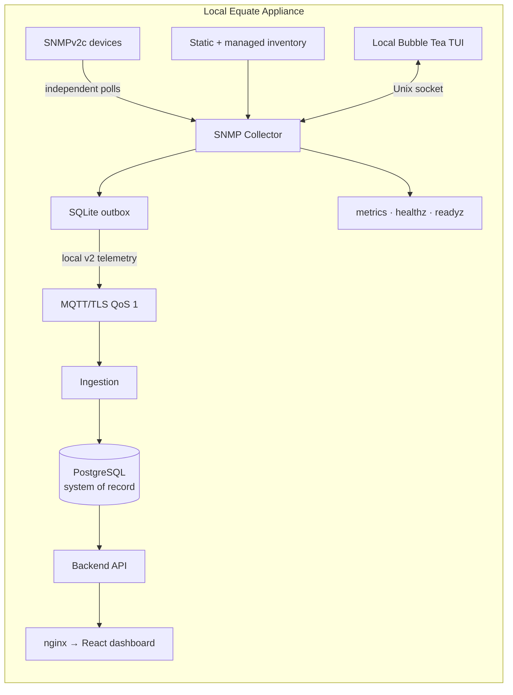

# System Design

Canonical architecture is documented in
[`.ai/project-context/architecture.md`](../../.ai/project-context/architecture.md).

The collector sends device, interface, health, and heartbeat telemetry. Dependency edges are local reachability evidence; they are not a complete physical-network graph. The TUI and status/control surface remain local-only.
